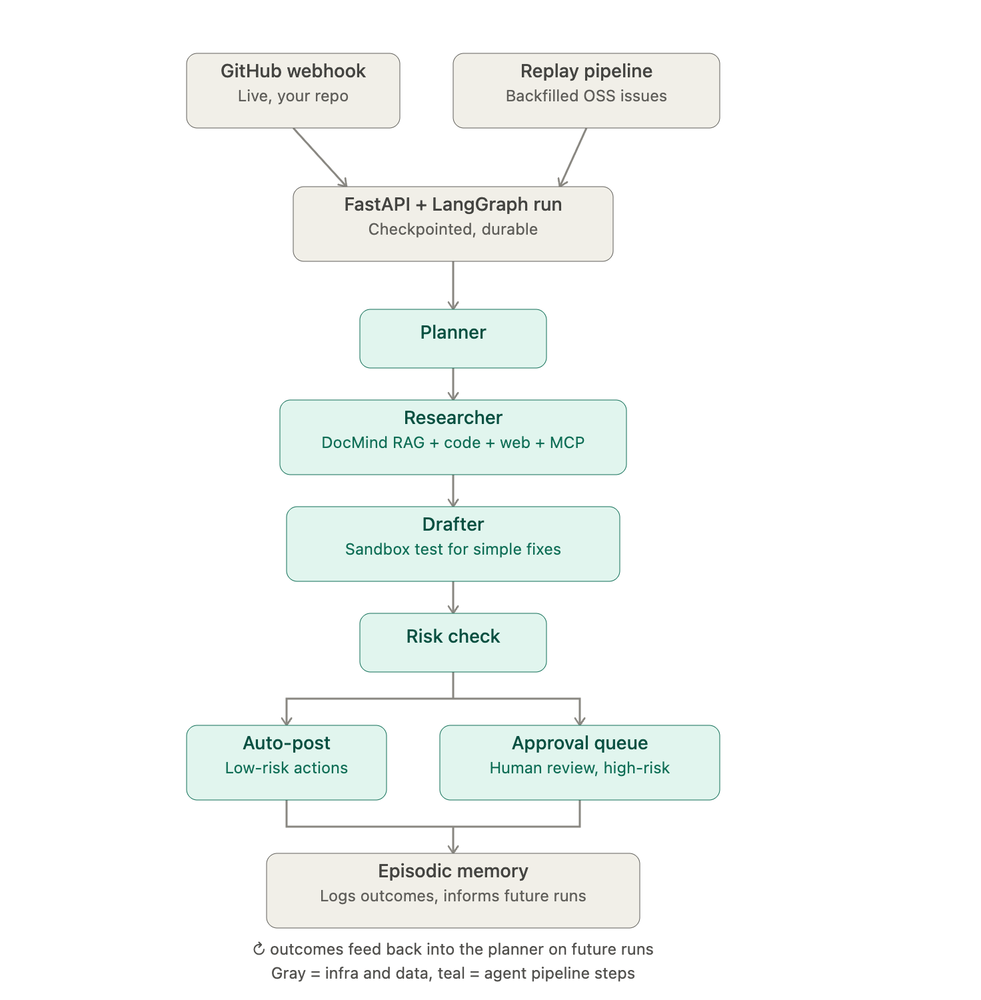

Why two entry points at the top
This is the part that trips people up first, so let's be clear about it: TriageBot never runs on empty. Your own repos won't have hundreds of real issues to learn from, so there are two parallel sources of issues:

GitHub webhook — real, live issues on your actual repo, as they happen.
Replay pipeline — hundreds of old issues from a big open-source repo (like FastAPI or LangChain), fed through the agent as if they were brand new. This is what gives you enough volume to demo it convincingly and to build the memory/eval data described below.

Both paths feed into the same graph — the agent doesn't know or care whether an issue is "real-time" or "replayed."
The five-step pipeline (the part that does the thinking)
This is a zoomed-in version of "Agent investigates" and "Agent decides risk" from the simple picture:

Planner — reads the raw issue and figures out: what kind of issue is this, and what needs investigating?
Researcher — actually goes and checks: searches your codebase, pulls from indexed docs (via DocMind, your first project), searches the web if needed.
Drafter — writes the actual response. For issues that look like simple, well-scoped bugs, it goes a step further: reproduces the bug in an isolated sandbox and tests a real code fix.
Risk check — decides how much trust this action deserves.
Auto-post or Approval queue — low-risk actions (like a label or a clarifying comment) go out immediately. Anything riskier — especially a proposed code fix — waits in a queue for you to approve or reject.

Every outcome, either way, gets logged to episodic memory — a record the Planner checks on future issues, so TriageBot's second month of decisions is better-informed than its first day.
What wraps around all of this (the part that makes it "production," not a demo toy)
These aren't extra nodes in the graph — they're systems that touch every node:

Observability — every run is traced end-to-end (OpenTelemetry + Langfuse), so you can see exactly what the agent did and why, and how long each step took.
Guardrails — hard limits baked in: max iterations, cost ceilings, and every tool call validated against a strict schema before it's allowed to execute.
Injection defense — since the agent reads untrusted text (issue bodies written by strangers) and can take real actions, it's tested against people trying to manipulate it through the issue text itself.
Trajectory evals — not just "was the final answer good," but "did the agent investigate in a sane order without looping or wasting calls."

The finished product you'll actually show people

An ops dashboard (Next.js) — a live feed of issues being triaged, a queue of things waiting on your approval, and per-run cost/latency numbers.
Both modes running side by side — a live feed from your real repo, plus a rich backfilled history proving it works at scale.
A documented near-miss — one real case where the agent almost did something wrong (e.g. mislabeling a valid bug as a duplicate) and the guardrail that caught it. This is arguably the single best interview story the whole roadmap produces — "here's a system I built, here's where it could have failed, here's the safeguard I designed for exactly that."

Full stack: LangGraph, MCP, E2B/Modal, PyGithub, Tavily, Pydantic, OpenTelemetry + Langfuse, Postgres, Next.js/TypeScript.