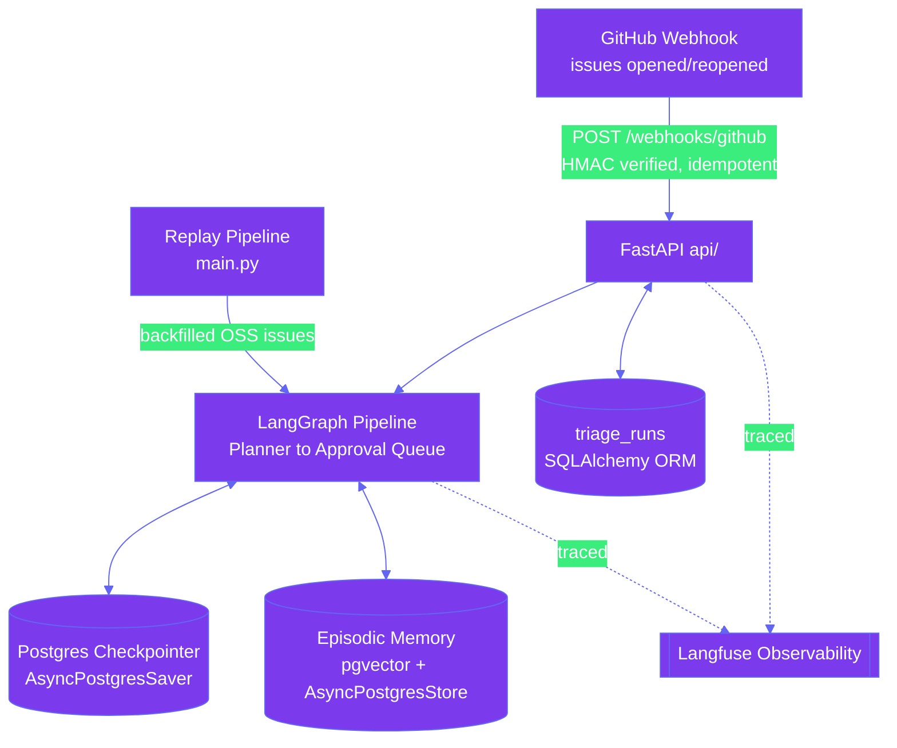

# Triage Bot — Product Vision & Architecture

```mermaid
%%{init: {'theme':'base', 'themeVariables': {'primaryColor': '#7C3AED', 'primaryTextColor': '#FFFFFF', 'primaryBorderColor': '#6366F1', 'lineColor': '#6366F1'}}}%%
flowchart TD
    A[GitHub Webhook<br/>issues opened/reopened] -->|POST /webhooks/github<br/>HMAC verified, idempotent| C[FastAPI api/]
    B[Replay Pipeline<br/>main.py] -->|backfilled OSS issues| D
    C --> D[LangGraph Pipeline<br/>Planner to Approval Queue]
    D <--> E[(Postgres Checkpointer<br/>AsyncPostgresSaver)]
    D <--> F[(Episodic Memory<br/>pgvector + AsyncPostgresStore)]
    C <--> G[(triage_runs<br/>SQLAlchemy ORM)]
    D -.->|traced| H[[Langfuse Observability]]
    C -.->|traced| H
```

## Why two entry points at the top

This is the part that trips people up first, so let's be clear about it: Triage Bot never runs on empty. Your own repos won't have hundreds of real issues to learn from, so there are two parallel sources of issues:

- **GitHub webhook** — real, live issues on your actual repo, as they happen.
- **Replay pipeline** — hundreds of old issues from a big open-source repo (like FastAPI or LangChain), fed through the agent as if they were brand new. This is what gives you enough volume to demo it convincingly and to build the memory/eval data described below.

Both paths feed into the same graph — the agent doesn't know or care whether an issue is "real-time" or "replayed."

## The five-step pipeline (the part that does the thinking)

This is a zoomed-in version of "Agent investigates" and "Agent decides risk" from the diagram above:

1. **Planner** — reads the raw issue and figures out: what kind of issue is this, and what needs investigating? Spam or abusive issues are short-circuited right here — a `close` action is proposed directly, skipping straight to human approval rather than continuing through Researcher/Drafter/Risk check.
2. **Researcher** — actually goes and checks: searches your codebase, pulls from an indexed docs/codebase server (via DocMind, an optional MCP integration — the Researcher degrades gracefully and just notes the gap if it isn't configured), searches the web if needed.
3. **Drafter** — writes the actual response. For issues that look like simple, well-scoped bugs — or feature requests for new functionality — it goes a step further: reproduces the bug (or the desired new behavior) in an isolated sandbox and tests a real code fix. A grounding self-check flags any claim the draft can't actually support from what the Researcher found.
4. **Risk check** — decides how much trust this action deserves.
5. **Auto-post or Approval queue** — low-risk actions (like a label or a clarifying comment) go out immediately. Anything riskier — especially a proposed code fix — pauses the run (via LangGraph's `interrupt()`, checkpointed so it survives a restart) and waits for you to approve or reject each one individually. A code fix you approve becomes a real pull request, built from the drafter's sandboxed diff against the exact commit it was verified against.

Every outcome, either way, gets logged to episodic memory — a record the Planner checks on future issues, so Triage Bot's second month of decisions is better-informed than its first day.

## The API surface (`api/`) — built

This used to be future work; it isn't anymore. `api/app.py` is a FastAPI app whose lifespan opens a shared Postgres connection pool, the checkpointer, the episodic memory store, and a SQLAlchemy engine for the `triage_runs` tracking table — all wired into one `TriageRunService`. It exposes:

- An HMAC-verified, idempotent GitHub webhook receiver that starts a fresh run.
- Resume (`GET`/`POST /runs/{owner}/{repo}/{issue}/resume`) and retry endpoints for the human-approval flow.
- Read-side dashboard endpoints — paginated run list, run detail, status-summary counts — meant to back a future ops-dashboard UI.

`/runs/*` routes require a bearer token; the webhook route is authenticated separately by its own HMAC signature. `main.py`'s replay pipeline is untouched by this — it still uses its own SQLite checkpointer and an interactive terminal approval prompt, not `TriageRunService`.

## What wraps around all of this (the part that makes it "production," not a demo toy)

These aren't extra nodes in the graph — they're systems that touch every node:

- **Observability** — every run is traced end-to-end via Langfuse (an OpenTelemetry-based SDK under the hood), so you can see exactly what the agent did and why, and how long each step took — see `docs/agent/architecture-conventions.md`'s "Observability" section for the mechanism.
- **Guardrails** — hard limits baked in and actually enforced, not just tracked: max iterations, cost ceilings (checked before every LLM/tool call, aborting the run the moment either is met), tool-call/sandbox-attempt caps, and every tool call validated against a strict schema before it's allowed to execute. Every cap lives in one centralized `GuardrailSettings` config (`config/guardrail_settings.py`) rather than scattered per-module constants. Cost accounting is prompt-cache-aware: `RunMeta` tracks OpenAI's automatic prompt-cache hit/miss breakdown per run (`cache_read_tokens`/`cache_creation_tokens`), feeding accurate `estimated_cost_usd` numbers rather than overcounting once caching silently engages on a long enough prompt.
- **Injection defense** — since the agent reads untrusted text (issue bodies written by strangers) and can take real actions, it's tested against people trying to manipulate it through the issue text itself: six OWASP LLM Top 10-mapped techniques, all run against the live pipeline. Full table and the one honestly-stated residual gap: `docs/agent/security.md`.
- **Trajectory evals** — not just "was the final answer good," but "did the agent investigate in a sane order without looping or wasting calls," graded cross-provider (Anthropic judging an OpenAI-run agent). Full detail: `docs/agent/evals.md`.

## What's still ahead

- **A real internal ops dashboard** — a live feed of issues being triaged, a queue of things waiting on your approval, and per-run cost/latency numbers, consuming the read-side endpoints `api/` already exposes. This is still unbuilt, and Next.js/TypeScript remains the plan for it — **distinct from `github_page/`** (below), which is a marketing/portfolio site, not a live operational view.
- **`github_page/`** — a React 19 + Vite + Three.js/GSAP marketing site is live now at [analyst-harsh.github.io/Triage-Bot](https://analyst-harsh.github.io/Triage-Bot/), showing the pipeline, the security posture, and the tech stack. Its dashboard visual is an illustrative mockup, not a real screenshot of the (not-yet-built) ops dashboard above.
- **A documented near-miss** — one real case where the agent almost did something wrong (e.g. mislabeling a valid bug as a duplicate) and the guardrail that caught it, written up as a concrete story. Roadmap item, not done yet.

Full stack: LangGraph, LangChain, MCP, E2B, PyGithub, Tavily, Pydantic, FastAPI, Postgres/pgvector, SQLAlchemy, Langfuse (OpenTelemetry-based), and — for the still-unbuilt ops dashboard specifically — Next.js/TypeScript.
